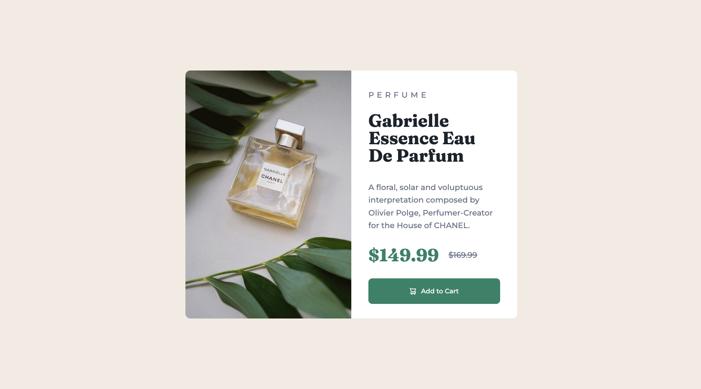

# Frontend Mentor - Product preview card component solution

This is a solution to the [Product preview card component challenge on Frontend Mentor](https://www.frontendmentor.io/challenges/product-preview-card-component-GO7UmttRfa). Frontend Mentor challenges help you improve your coding skills by building realistic projects. 

## Table of contents

- [Overview](#overview)
  - [The challenge](#the-challenge)
  - [Screenshot](#screenshot)
  - [Links](#links)
  - [Built with](#built-with)
  - [My Process](#my-process)

## Overview

### The challenge

Users should be able to:

- View the optimal layout depending on their device's screen size
- See focus states for interactive elements

### Screenshot

### Links

- Solution URL: [Add solution URL here](https://your-solution-url.com)
- Live Site URL: [Add live site URL here](https://your-live-site-url.com)

### Built with

- HTML5 markup
- CSS custom properties
- Flexbox
- Mobile-first workflow

### My Process

I've just started learning to code again after taking a longer-than-intended break. This project really tested my ability to recall knowledge I haven't used for a while. It helped me gauge how much I remember (surprisingly more than I thought!) and what I need/want to work on.

After opening the starter files in VS Code, I started by sectioning out the HTML and adding relevant classes and ids. I wanted to tackle the mobile version first so I added the image for the mobile screen size to the HTML - on reflection I could have added both images at this time.

I then created the styles.css file. My first selector aimed to give me a 'blank slate' by eliminating any margins or padding. I added the font family here too as majority of the text would be styled with it. I tried to work down from most generalised down to the finer styling - this is something I plan to practice more.

Admittedly, most of my time on this project was spent tweaking the css to reflect the design images as accurately as possible.

Next I'd like to focus on improving my HTML for accessibility and incorporating Javascript into my projects.

